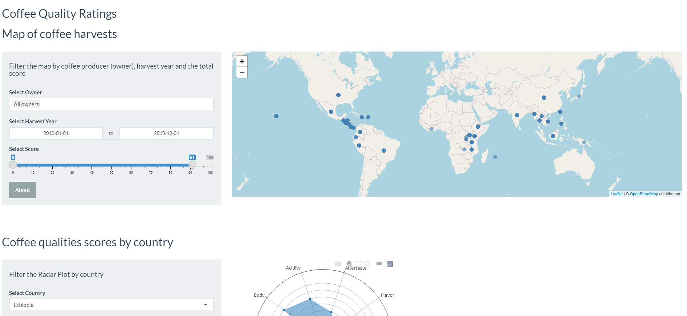

# Exploring coffee ratings dataset with R
This is a dashboard created with R and Shiny. 

# Prerequisites
- Rstudio
- plotly
- ggplot2
- dplyr
- stringr
- shiny
- shinyWidgets
- leaflet

# Contents
- **coffee_ratings.Rmd**: Main script file that launches the dashboard
- **coffee_ratings.html**: Preview of the script, knitted to HTML
- Two CSV files with additional data (continents and latitude & longitude per country)

# Dashboard preview

